# Визуальное сравнение карточек

Снимки сделаны 17 сентября 2026 года:

- `before-*` — действующие страницы `https://kpshelkovo.online/map/…/`.
- `demo-*` — исторический макет; исходники демо удалены после переноса по просьбе владельца.
- `after-*` — итоговые публичные карточки на локальной production-сборке.
- Desktop: viewport 1440 × 1000; mobile: 390 × 844. Все снимки захватывают страницу целиком.
- Подложка карты и текущий статус зависят от внешнего API и времени. Изображения служат для визуального обсуждения, а не для pixel-тестов.

## Буржуйка

### Итоговая карточка

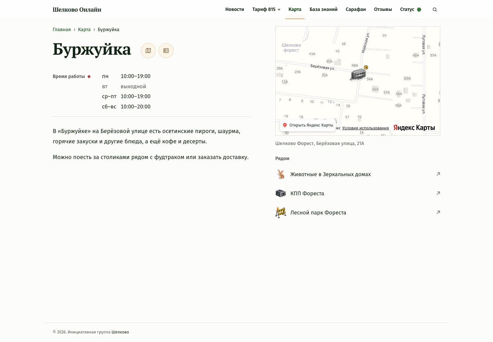

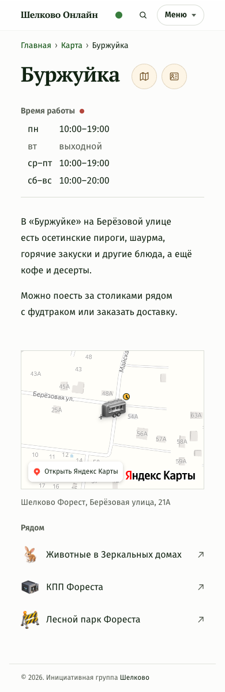

### Desktop: исходная карточка

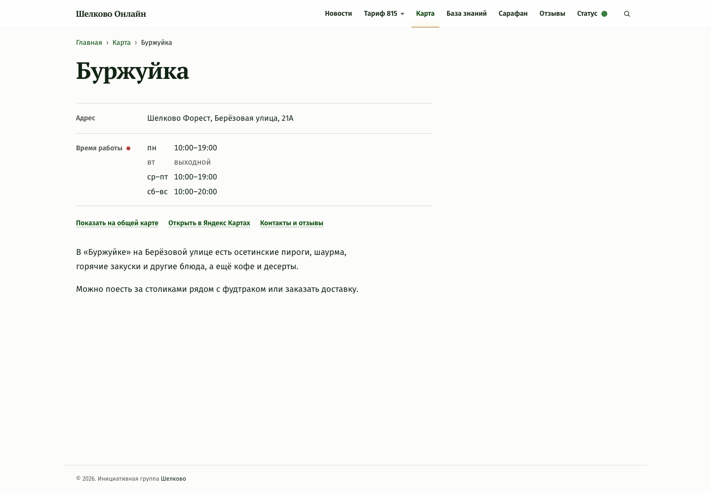

### Desktop: демо

### Mobile: исходная карточка

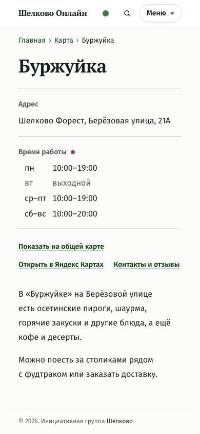

### Mobile: демо

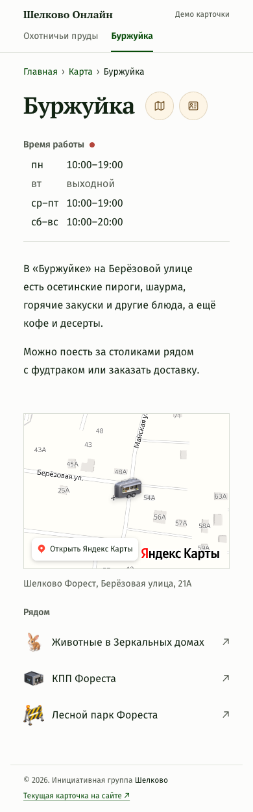

## Охотничьи пруды

### Итоговая карточка

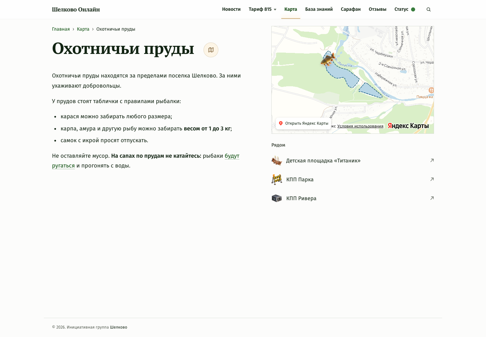

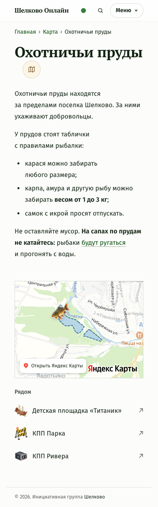

### Desktop: исходная карточка

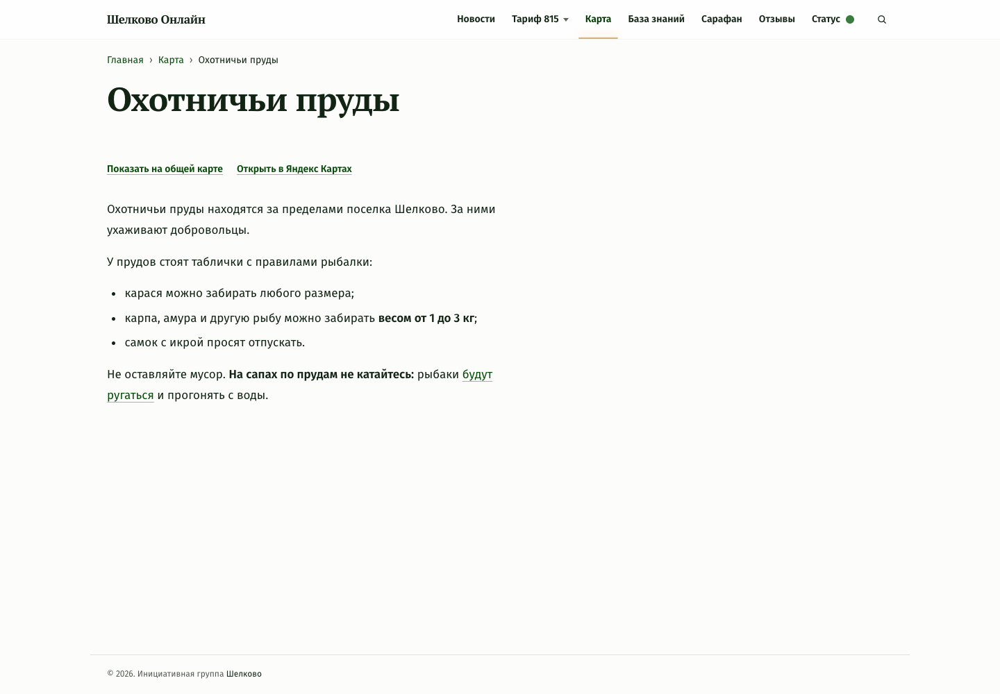

### Desktop: демо

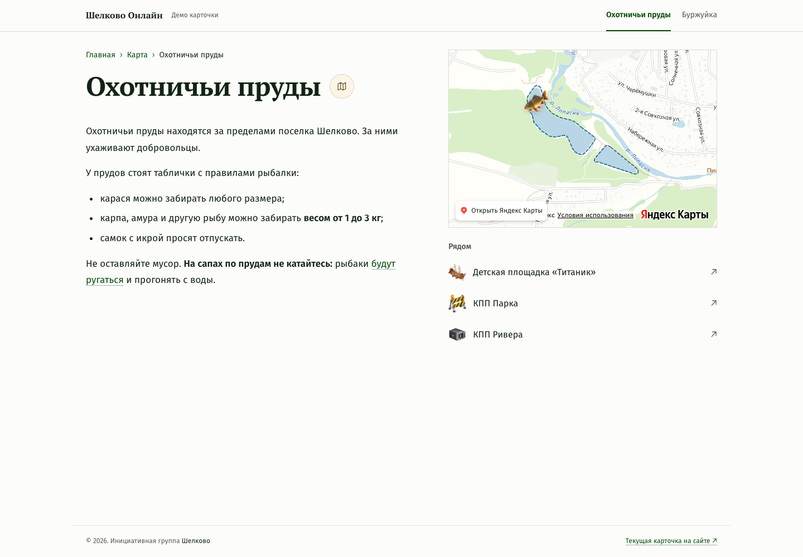

### Mobile: исходная карточка

### Mobile: демо

## Перенос длинного заголовка

Кнопка следует за последней строкой заголовка. Зазор до группы действий совпадает с «Сарафаном»: `1.25rem`, от `48rem` — `1.75rem`.

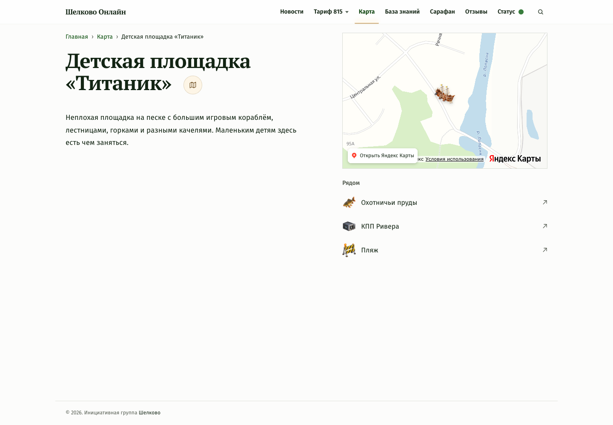

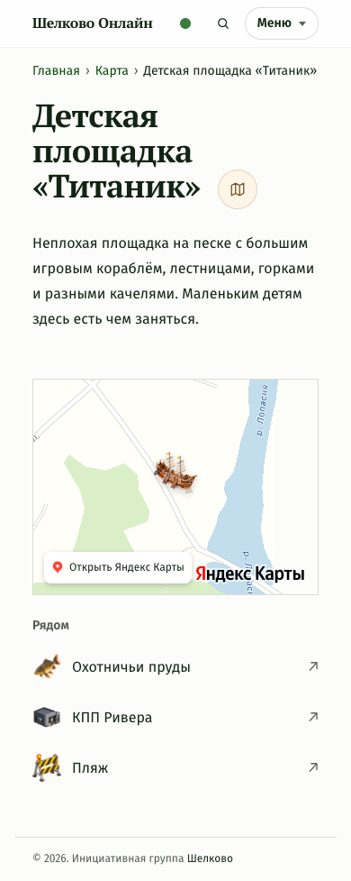
