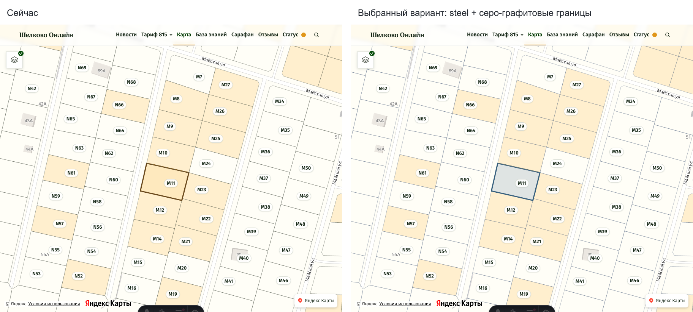

# Design

## Context

Мотивация — в [proposal.md](proposal.md). `parcel-layer.ts` обслуживает только общую `/map/`: `normalStyle` задаёт статусное оформление, `selectedStyle` — выбор на пять секунд, `clearSelection` восстанавливает исходный стиль. Все пути выбора уже используют одну функцию: нажатие контура, активация номера и переход по коду.

Применимые решения:

- [ADR-034](../../../docs/decisions/034-native-css-architecture.md): feature-local CSS properties принадлежат компоненту; SDK получает вычисленные CSS-цвета через `getComputedStyle`, без параллельной JS-палитры.
- [ADR-041](../../../docs/decisions/041-parcel-records-and-exact-search.md): слабая статусная окраска — вспомогательная подсказка из сохранённых сведений; кадастровые границы частей одной позиции сохраняются.

В текущем дизайн-гайде нет нейтрального интерактивного синего: `water` имеет сервисный смысл, фиолетовый Домиленда — брендовый. Нужен собственный локальный цвет выбора карты.

## Goals / Non-Goals

**Goals:**

- Развести роли обычной границы, сохранённого статуса и текущего действия пользователя.
- Получить выразительный выбор штатными `fill`, `fillOpacity` и `stroke` SDK.
- Согласовать визуальный вариант на настоящей карте до реализации.

**Non-Goals:**

- Штриховка, отдельный canvas/SVG overlay, новая анимация или изменение жестов карты.
- Перекраска общесайтового фокуса, подписей номеров, брендовых маркеров и других карт.

## Decisions

### Локальная палитра и простой стиль

В scoped CSS `PlaceMap.svelte` на корне карты объявить `--parcel-map-boundary` и `--parcel-map-selection`; существующий helper `token()` читает их с контейнера SDK. Значения и назначение синхронно описать в разделе общей карты дизайн-гайда. Общие `accent`, `water` и брендовые токены не переопределять.

Стартовые параметры для визуальной приёмки:

- Обычная граница: холодный серо-графитовый `oklch(55.4% 0.041 257.4)`, близкий к `#64748b` из демо. Толщина 1 px; существующая непрозрачность 0.5, для недоступных — 0.2.
- Выбор: приглушённый синий steel `oklch(46.9% 0.067 241.9)`, близкий к `#365f7d` из демо. Сплошная заливка с непрозрачностью 0.16, сплошной контур 3 px с полной непрозрачностью.
- Продажа: действующая тёплая заливка `accent` с непрозрачностью 0.22. Недоступность: действующая слабая серая заливка и сероватый номер.

OKLCH соответствует формату палитры проекта, но сам формат не гарантирует доступности. Оттенки и прозрачность допускают небольшую подстройку по браузерной приёмке в рамках выбранного направления; финальные значения CSS и дизайн-гайда должны совпадать.

Сохранение нынешнего `accent` с другой прозрачностью не разделяет роли. Штриховка различала бы выбор рисунком, но `DrawingStyle` установленного `@yandex/ymaps3-types@1.0.20914674` не объявляет штатной pattern-заливки; отдельный рендер избыточен. Один усиленный контур без заливки слабее выделяет всю площадь. Поэтому выбран существующий механизм сплошной заливки и обводки. После сравнения индиго, steel, петрольного и сливового оттенков на настоящей карте владелец выбрал более спокойный steel.

### Сдержанная обратная связь

Из `apple-design` применимы ясность состояния, предсказуемость и простота: один локальный акцент в точке действия, мгновенная смена оформления и спокойная прозрачная заливка. Толщина контура служит дополнительным к цвету признаком. Поведение остаётся статическим и понятным при reduced motion.

### Визуальный образец

Снимки сделаны на локальной `/map/?p=SHF-M11` при zoom 18 и viewport 900 × 760. Для сравнения оформление временно заменено в экземплярах SDK через браузер; выбор закреплён на время снимка. Это визуальная примерка, а не проверка реализации или пятисекундного таймера. Изменения исходников приложения для демо не требовались.

Для выбранного `#365f7d` расчётный контраст составляет 6.80:1 с белым, 5.36:1 с собственной заливкой 16% поверх белого и 5.98:1 с образцом тёплого соседнего фона `#ffefcc`. Все три пары выше 3:1 для UI-графики. Эти расчёты не доказывают читаемость на любой детали карты: реальную подложку, текст номеров, общий масштаб и узкий экран нужно проверить при реализации.

### Проверки в существующих местах

В `PlaceMap.test.ts` уже проверяются заливки статусов, возврат оформления, смена выбора, URL и MultiPolygon. Обновить затронутые ожидания и тестовые CSS properties; проверять различие цветов статуса и выбора, усиление контура и полное восстановление стиля, а не закреплять точные hex или CSS-классы как продуктовый контракт. Новая тестовая инфраструктура не нужна.

## Risks / Trade-offs

- Светлая или пёстрая подложка меняет восприятие полупрозрачной заливки → визуально проверить масштаб первого появления номеров и более крупный масштаб, участки с разными статусами и фон с подписями/строениями.
- Неразличение оттенков → сохранить трёхкратную толщину контура, проверить обесцвеченный кадр и видимый клавиатурный фокус; мягкая заливка не должна быть единственным признаком выбора.
- Цвет будущего CSS слегка отличается от hex-примерки из-за округления OKLCH → сверить финальные значения в браузере и приложить актуальный результат к PR.

## Migration Plan

Владелец выбрал steel и разрешил реализацию после визуальной примерки. Реализация добавляется в ту же ветку и PR. Миграция данных не требуется; откат реализации возвращает прежние локальные стили и соответствующую документацию.
